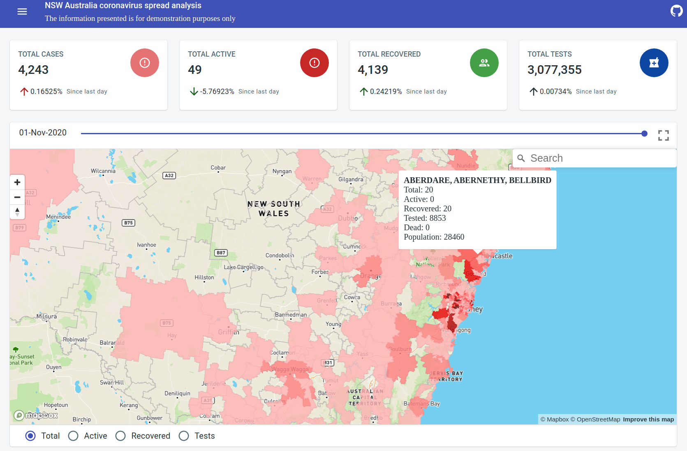

# NSW Australia coronavirus spread analysis

## Web application showing COVID spread statistics for NSW, Australia

#### *The information presented is for demonstration purposes only and not for research or any other purposes. No part of these pages, either texts or images may be used for any purpose other than personal use*

## [Demo](https://maxgherman.github.io/nsw-coronavirus/)

### Tech stack

- [x] Data source: **NSW Government** https://www.nsw.gov.au/covid-19/find-facts-about-covid-19
- [x] Front-end
    - Static SPA: **Create React App** https://create-react-app.dev/
    - Map visualization: **MapBox** https://www.mapbox.com/
    - Statistical analysis: **Simple statistics** https://simplestatistics.org/
    - Chart visualization: **Recharts** http://recharts.org/
    - Histogram: **compute-histogram** https://www.npmjs.com/package/compute-histogram
- [x] CI/CD: **Github Actions** https://docs.github.com/en/actions
- [x] Hosting: **Github pages** https://pages.github.com/

### Features

- Geomap suburb visualization using geojson
- Daily data split
- Summary of the metrics: Cases, Active Cases, Recovered, Tests
- Suburb data split
- Correlation of cross-pairs of metrics: Cases, Active Cases, Recovered, Tests
- Linear regression of cross-pairs of metrics: Cases, Active Cases, Recovered, Tests

### Architecture

- Github action is triggered by schedule
- CI/CD agent downloads data from the 3dr party server
- CI/CD agent builds static web site assets
- CI/CD pushes downloaded data along with the build artifacts into the gh-pages branch
- Client connects to Github static website hosting

### Tutorial

[Statistical analysis pipeline](https://www.max-gherman.dev/docs/design/statistical-analysis/contents)

